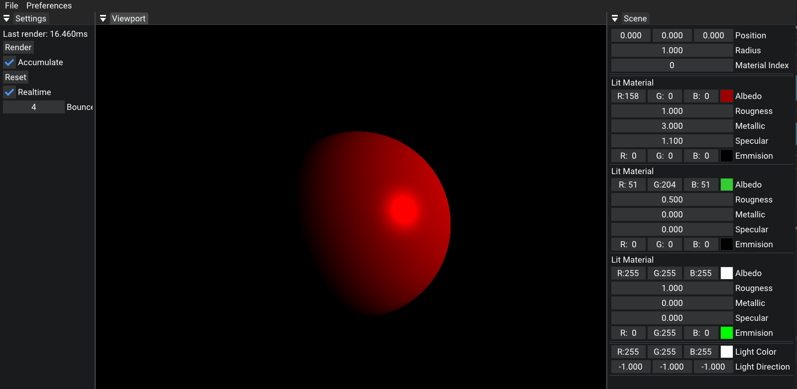

# ExpressRTX

ExpressRTX is a high-fidelity graphics program built using C++ and Vulkan.

## Getting Started
Once you've cloned, run the setup.bat in the scripts folder for which Visual Studio version that you would like to use

# Requirements 
 - Vulkan SDK
  * You can install the SDK <a href="https://vulkan.lunarg.com/sdk/home#windows">here</a>
  
## Technologies
* Vulkan
* Visual C++ Build Tools
* Visual Studio (2022, 2019, and 2017 supported)
* Premake

## Features
* Real Time, Multithreaded Path Tracer on the CPU.
* Sphere Rendering.
* Light and Dark theme
* Customizable Material System

## Roadmap
* Ability To Render Triangles (This will make it so we can render models)
* Texture System
* File Save System
* Animation / Physics systems
* Point, Spot, and Directional Lights
* GPU Accellerated Rendering

### Disclaimer
This Project was build on top of <a href="https://hazelengine.com/">Hazel</a> using the <a href="https://github.com/TheCherno/Walnut">Walnut</a> framework. 
We are also following along The Chernos <a href="https://github.com/TheCherno/RayTracing">tutorial</a>, but are also adding our own features.

### Legal
In installing this software you agree to the terms and conditions defined in <a href="LICENSE.txt">LICENSE.txt</a>